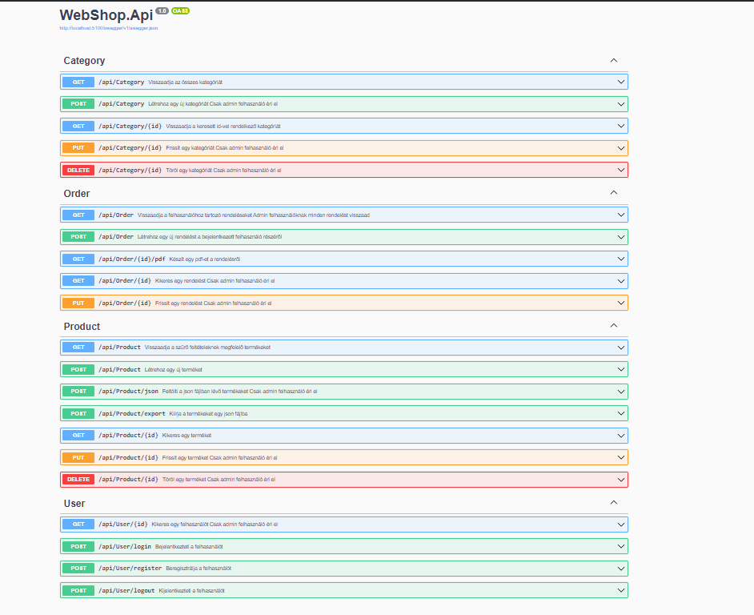
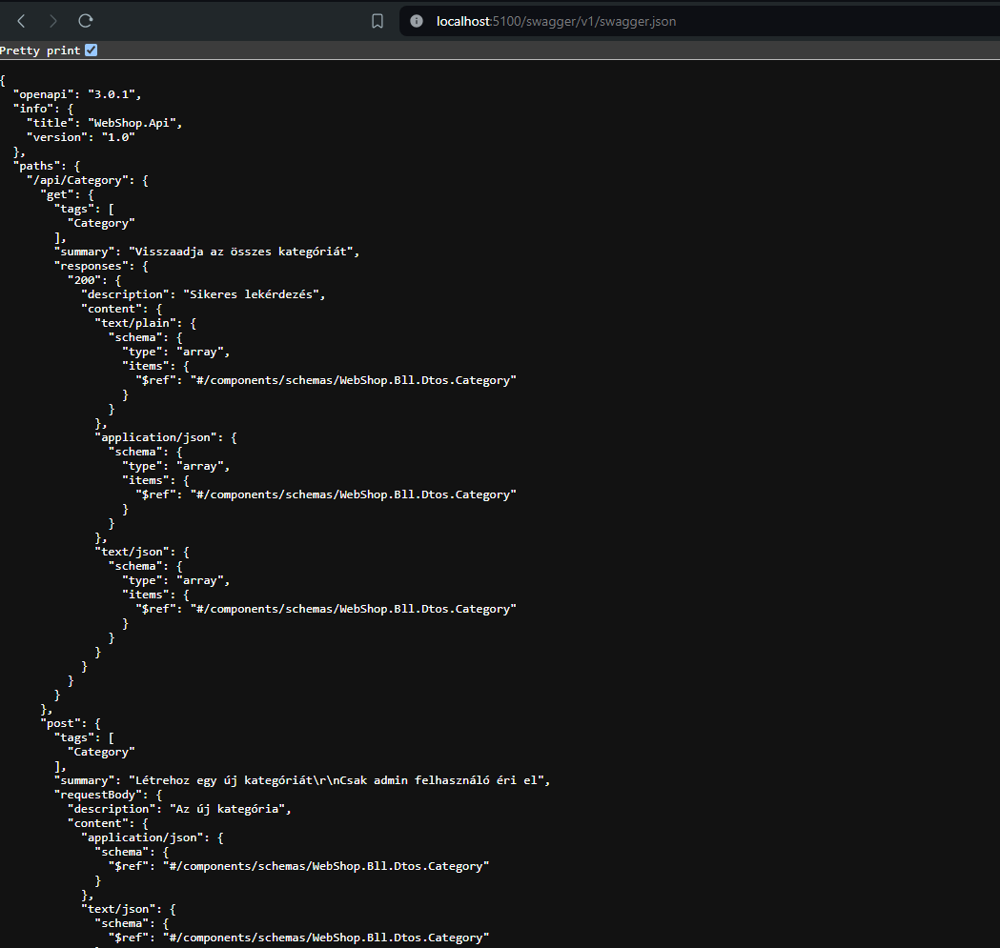
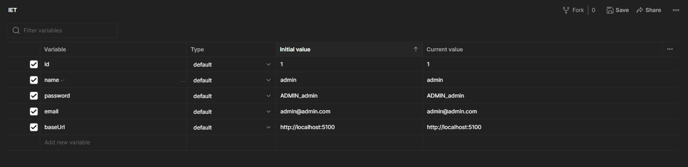
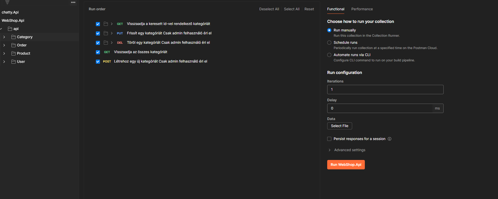
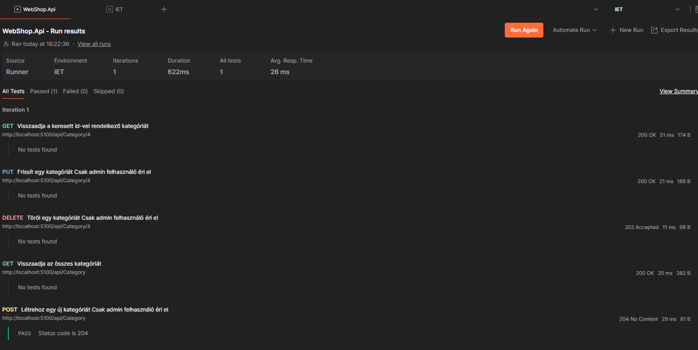

# API-Testing

## Swagger UI

A Swagger UI böngészű alapú, szép dokumentációt készít az API-ról, amivel akár innen is tesztelhetjük, küldhetünk kéréseket a szervernek.
Ha bővebb funkcionalitást szeretnénk érdemes lehet Postmant használni.

## Postman

Az API teszteléshez a Postman nevű alkalmazást használom.

A Swagger segítségével generálható olyan OpenAPI (OAS) szabványt követő leírás/dokumentáció, amit JSON formátumban kiexportálva a Postman képes feldolgozni. 
A fájl tartalmazza az egyes API végpontokat, paramétereit, lehetséges válaszait.

>Egy részlet a fájlból:

A teljes forrásfájl elérhető a docs/resources/API-testing mappában, vagy könnyedén letölthető a szerver futtatása után a *http://localhost:5100/swagger/v1/swagger.json* címről.

## Importálás Postmanbe

A fenti JSON fájlt importálva feldolgozás után kollekciókba kategorizálva elérhetőek az egyes kérések és könnyedén tesztelhetjük őket akár egyszerre.

Ehhez létrehozhatunk **environment** változókat, amikre a kéréseknél **{{variable}}** névvel hivatkozhatunk.\
Ez azért hasznos, mert ha például adminként akarunk tesztelni valamit, elegendő csak átírni az email és password mezőket és fordítva.

>

## Tesztelés automatizálása

Minden mappában elérhető kérést egyszerre futtathatunk, de van opció az összes kérés egyszerre tesztelésére is.

Lehetőségünk van extra testeket is írni egy-egy kéréshez javascriptben, ahol például a várt státusz kódot ellenőrizhetjük.
Például új kategória létrehozásánál a POST metódusnak nincs tartalma (no content), de ellenőrzhetjük hogy tényleg 204-es kóddal tér e vissza.

> A Category végpontok sikeres tesztelése:

Az összes kérés egyidejű tesztelésére nem volt lehetőség, mivel a Postman ingyenes verzióban limitálja az egységidő alatt egyszerre elvégezhető kérések számát, viszont egyenként tesztelve mindegyik végpont az elvártnak megfelelően működik.

## Összegzés

Ha egy éles projekten, szeretnénk karbantartani a végpontjainkat ez a módszer jónak bizonyul, főleg, hogy időzíteni is lehet a tesztelést.

Jelen projektben segített megbizonyosodni az API konzisztens és helyes viselkedéséről.

