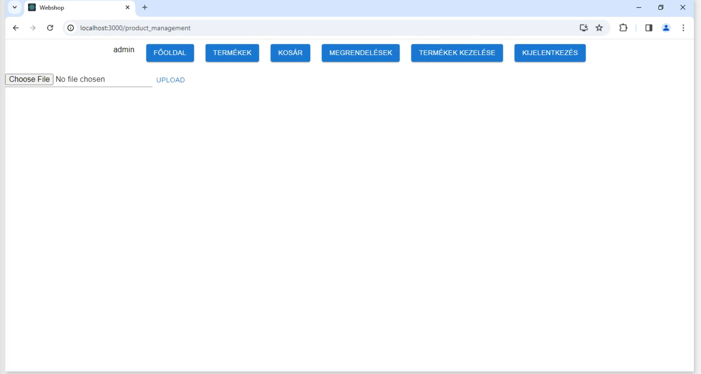
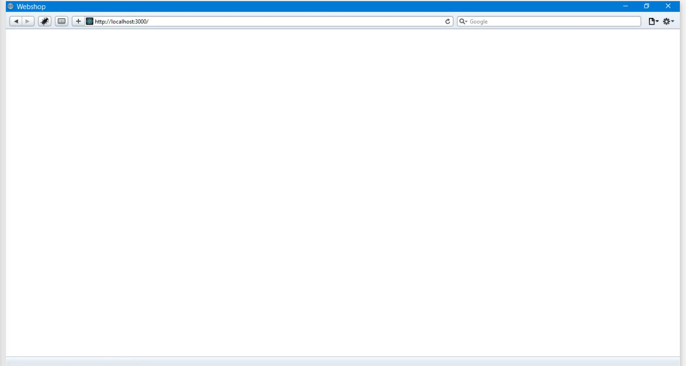
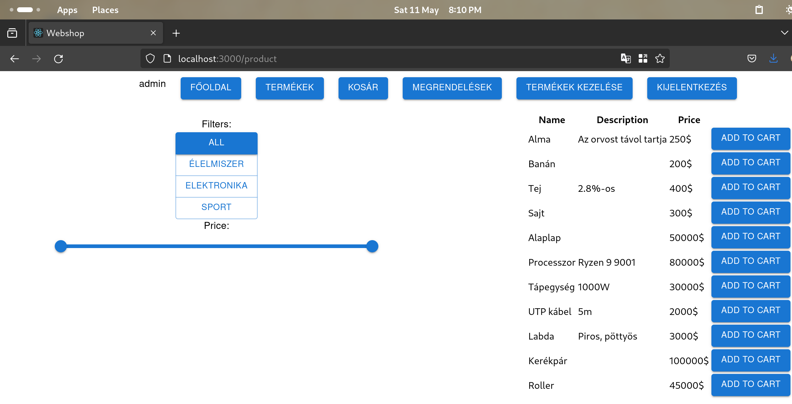
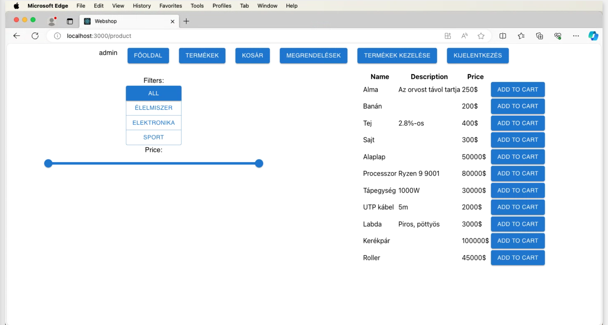
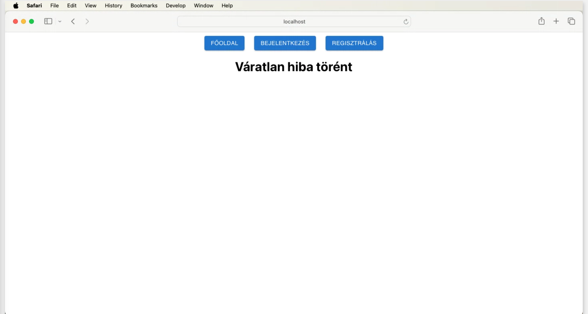
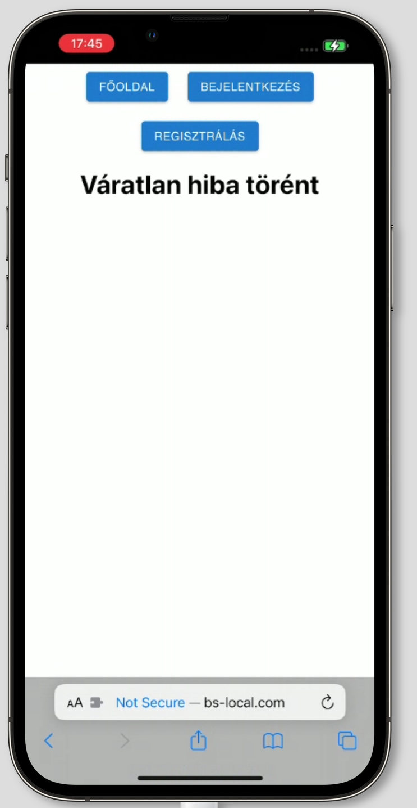
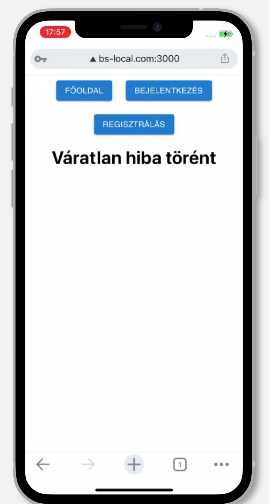
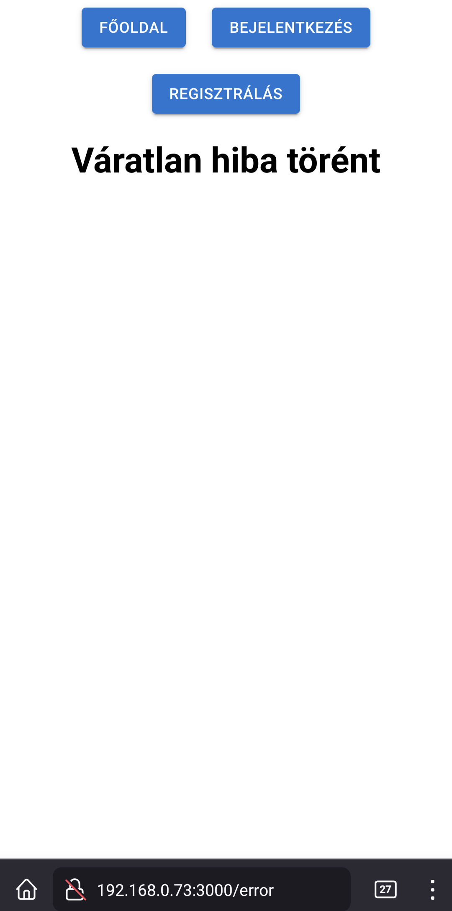

# Nem-funkcionális jellemzők tesztelése

## Biztonság

Az alkalmazás biztonságát a [Zed Attack Proxy](https://www.zaproxy.org/) programmal vizsgáltuk.
Két külön automatizált tesztet futtattunk: az egyik a frontend react appot vizsgálta, míg a másik a backend REST APIt.
A tesztek alapján generált reportok elérhetőek a [Security mappában](/NonFunctional-tests/Security) html-ként formázva.

A biztonsági tesztelés azt mutatta meg, hogy komoly sérülékenység nem található az alkalmazásban.

## Stressztesztelés

A Go alapú [k6](https://k6.io/) eszközt használtuk az alkalmazás stresszteszteléséhez, illetve a [k6-reporter](https://github.com/benc-uk/k6-reporter) script segítségével a tesztelésről HTML reportokat is generáltunk.
A backend REST API-t vizsgáltuk; 4 tesztfájl segítségével megfigyeltük hogyan kezelik a sok konkurens lekérdezést az alkalmazásunk különböző részei.
A tesztek kódja és a jelentések elérhetőek a [Stress mappában](/NonFunctional-tests/Stress).

A stressztesztelés azt mutatta meg, hogy az alkalmazásunk részben jól skálázódik, de a kategóriák és a felhasználók kezelésekor jelentkeznek problémák nagy terhelés mellett.

## Kompatibilitás

Az alkalmazásunkat különböző böngészőkben, különböző eszközökön is teszteltük a [BrowserStack](https://www.browserstack.com/) segítségével. Alkalmazásunkat több esközön és több böngészőben is teszteltük. Sajnos a BrowserStack-en keresztül az androidos eszközökön való tesztelés nem működött megfelelően, így androidon csak saját eszközünkön tudtunk tesztelni.

A tesztek alapján az autentikáció nem működik megfelelően a Safari böngészőben, illetve IOS eszközökön. A hiba oka az elvégzett tesztek alapján nem egyértelmű, további vizsgálatok szükségesek.

### Képernyőképek

Windows, Chrome:

Windows, Safari:

Linux, Firefox:

Mac, Chrome:

Mac, Safari:

IOS, Safari:

IOS, Chrome:

Android, Firefox:

