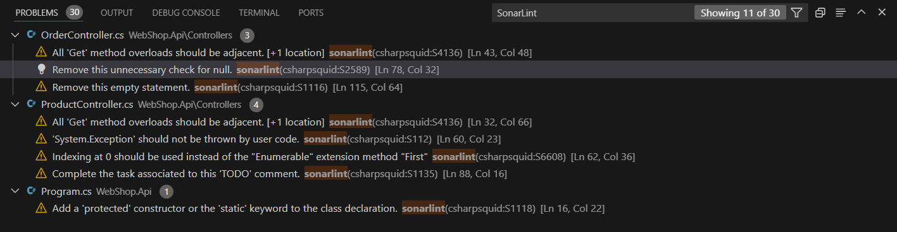
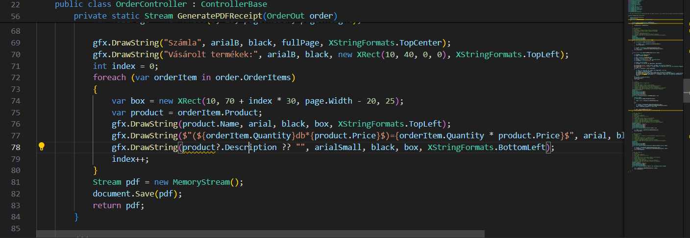
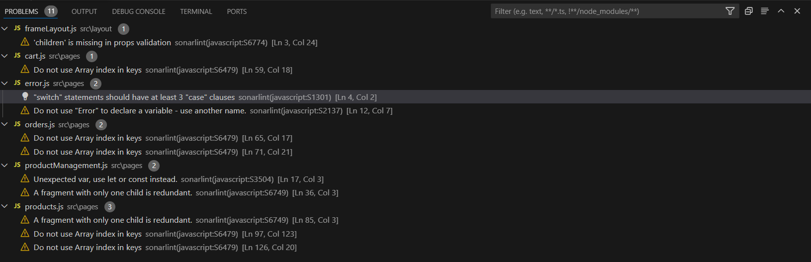
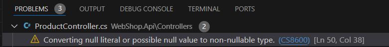
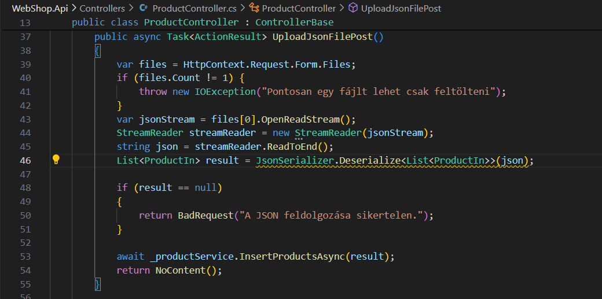

# Statikus analízis eszközök futtatása

## SonarLint

### Backend

WebShop API

A SonarLint 7 figyelmeztetést adott a WebShop Api Controller osztályaira, ebből három a ProductController osztályra vonatkozott.

Ezek közül a legjelentősebb a System.Exception dobás, hiszen nem forrás specifikus, így olyan helyen is el lehetne kapni, ahol nincsen megfelelően lekezelve, az Exception helyett egy specifikusabb IOException dobás megoldja a problémát.

A második, az Api-t futtató program osztály konstruktorára vonatkozott, ami automatikusan generálva publikus volt, így egy static kulcsszóval lehetett volna javítani, de mivel használjuk a Program classt egy WebApplicationFactorynál is (partial), így ez itt nem hiba.

A többi figyelmeztetés a kód olvashatóságára vonatkozik illetve a hatékonyságot segítik, ilyen például a listán First függvény helyetti nulla index használata is, ezeket a SonarLint javaslata mentén javítottuk.

Ilyen volt a GeneratePDFReceipt függvénybeli null check, amire már nincsen szükség, hiszen az ellenőrzött product objektumot már használtuk előtte, így az ott biztosan nem null.

### Frontend

A program frontend részén az alábbi figyelmeztetéseket adta a SonarLint:

A jelzett dolgok közül a "children is missing in props" és a "do not use Array index in keys" figyelmeztetéseket átugorjuk, az elsőt az átláthtóság, a másodikat a tömbelemek sorrendjének állandóságának feltételezése miatt.

Az 1 case ággal rendelkező switch utasítást lecseréltük egy if-re (hiszen felesleges egy egy ágas switchet definiálni), és a var változókat let-re. Ebben az esetben a var JS-ben globális változót hozna létre, ami helyett jelen esetben elég lenne egy let, ami csak az adott kódblokkban érvényes. Hasonlóan át lehet alakítani az 1 elemű fragmentet, ami így is megőrzi viselkedését.

## VS Code Analyzer
### Backend

Itt az XML kommentek hiányától eltekintve egy olyan figyelmeztetést adott a VS, amit a Sonar nem.

Itt egy olyan listának adhatunk **null** értéket, ami nem lehet null, így az érték konvertálódik, ami további gondokhoz vezethet. Mivel egyből az értékadás után van egy null ellenőrzés így a probléma egy **?** hozzáfűzésével és a Lista null értékének lehetővé tevésével megoldottuk.

A frontend részéhez nem talált problémát a VS és az eddigi figyelmeztetéseket (a jelzettek kivételével) javítottuk.