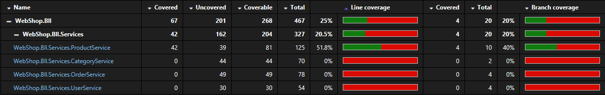
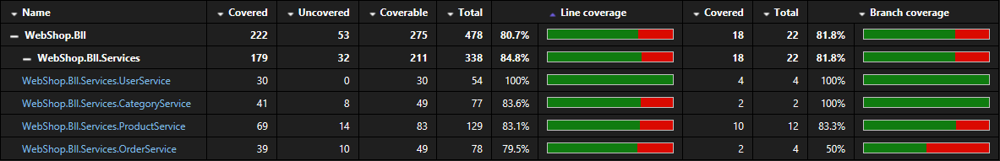

# Unit testing

A tesztek a biznisz rétegben lévő adatkezelő Service-eket tesztelik egység tesztek formájában.

A tesztek az adatbázist mockolják és ellenőrzik, hogy azon a szükséges metódusokat meghívja a tesztelet kód, illetve, hogy a helyes értékek kerülnek visszaadásra.

## Teszt lefedettség

A kezdeti egység tesztek által lefedett kód:

Az egység tesztek által lefedett kód kiegészítés után:

A tesztek nem fedik le a teljes kódot, mivel a az update metódusok nem mockolhatóknak biztonyultak.

A kód lefedettség adatokat a `coverlet` package gyűjtötte össze, illetve a `Fine Code Coverage` extension vizualizálta Visual Studioban.